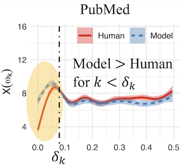
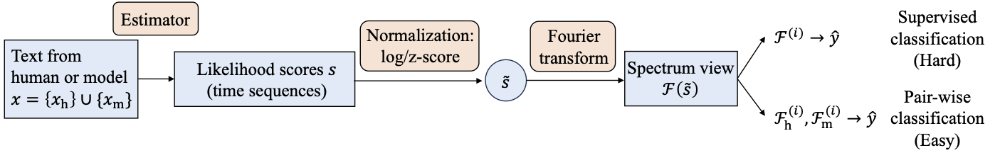

# FourierGPT -- A Psycholinguistics-inspired method for text detection

This repository contains code for the paper **"Detecting Subtle Differences between Human and Model Languages Using Spectrum of Relative Likelihood"** ([arxiv]()).

## What FourierGPT *is* and *is not*
FourierGPT is a method for detecting machine generated texts from human ones. For example, the following two pieces of text are responses to the same question, with one generated by GPT-4 and the other by human, respectively:

**Question**
```text
Question: Is an advance care planning model feasible in community palliative care?
```

**GPT-4's response**
```text
Answer: Yes, an advance care planning model is feasible in community palliative care. ...
```

**Human's response**
```text
Answer: An advance care planning model is feasible for community palliative care services. ...
```

While the two responses look very similar and convey the same meaning as well, there are still some subtle differences, such as the omitted *"Yes"* and the additional *"services"* in the human response.

Can we quantify these subtle differences? 

Our method applies Fourier transform to the relative likelihood scores of texts, which results in a spectrum view that can tell apart model and human responses: as shown in the figure below, GPT-4 has higher power magnitudes (on average) than human near the low frequency area of the spectrum.



FourierGPT is **NOT** a new language model based on GPT. The naming is inspired by the recently proposed zero-shot text detection methods [DetectGPT](https://arxiv.org/abs/2301.11305) and [Fast-DetectGPT](https://arxiv.org/abs/2310.05130).

Spectrum captures the how likelihood (surprisal, information density etc.) of language changes with time, which is related to psycholinguistics theories such as uniform information density (UID) [(see Meister et al. for a recent review)](https://aclanthology.org/2021.emnlp-main.74.pdf)

## Detection performance
FourierGPT works best on short text, such as the [PubMedQA dataset](https://aclanthology.org/D19-1259), and outperforms the SOTA. Part of the detection accuraries are as follows:

|Dataset|Gen. model|FourierGPT|Fast-DetectGPT|
|---|---|---|---|
|PubMed| GPT-4  | **0.9133** | 0.8503 |
|PubMed| GPT-3.5 | **0.9467** | 0.9021 |

For detailed report, please read the [paper]().

## Procedure
The general procedure of FourierGPT is shown in the following figure:



which roughly breaks into three steps:

### 1. Estimate likelihood scores
To estimate likelihood scores with GPT-2 models:

```bash
python run_nll.py -i INPUT_TEXT_FILE -o OUTPUT_NLL_FILE --model_path MODEL_PATH
```

- It produces likelihood scores in `OUTPUT_NLL_FILE` (NLL for negative log likelihood), which is estimated by the model in `MODEL_PATH`.
- You may specify `--model_path` to the path of your locally saved GPT-2 models

If you wish to use a larger model, for instance, mistral-7b or llama-7b, then you need to replace `--model_path` with `--config`, which points to a JOSN configuration file:

- The JSON config file must contains an `"args"` key, whose value is a list that contains a `--model_est` option for the local model's path.

```bash
python run_nll.py -i INPUT_TEXT_FILE -o OUTPUT_NLL_FILE --config CONFIG_PATH
```

### 2. Normalize likelihood and Fourier transform

Then, compute the normalized likelihood scores and then apply Fourier transform to obtain the spectrum data: 

```bash
python run_fft.py -i INPUT_NLL_FILE -o OUTPUT_FFT_FILE -p zscore --value norm
```

- You can specify `-p` for three normalization methods: `zscore`, `logzs`, or `minmax`.
- `--value` specifies the way for extracting spectrum data. The other two options are: `real` for real part, and `imag` for imaginary part.

### 3. Classification steps
Finally, take the spectrum data from previous step and perform classification.

For details, refer to the following notebooks:

- Use `circular.ipynb` to conduct circularization operation on likelihood scores.
- Use `classifier_circlemean.ipynb` for supervised classification.
- Use `classifier_pairwise.ipynb` for heuristic-based classification.


## Thanks
We sincerely thank [Guangsheng Bao](https://baoguangsheng.github.io/), the author of [Fast-DetectGPT](https://arxiv.org/abs/2310.05130), for the helpful discussions and for sharing the data.

## Notes and citation
This repository is currently under construction. Additional data and code will be added soon.

If you find our work useful, you can cite it with:
```bibtex
@article{
    title={},
    author={},
    year={2024}
}
```